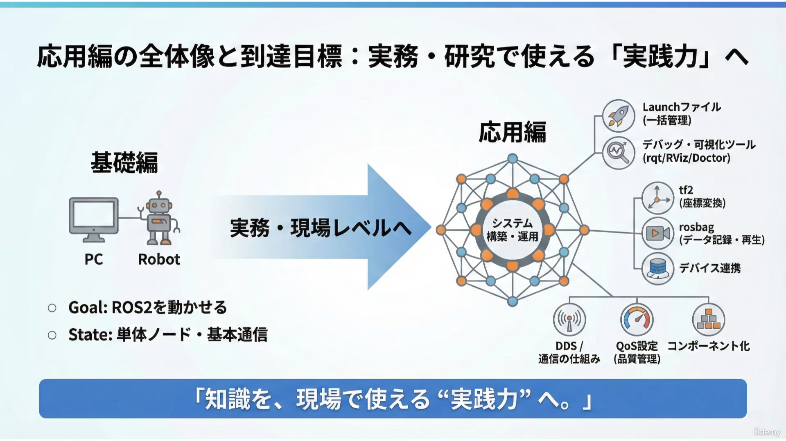
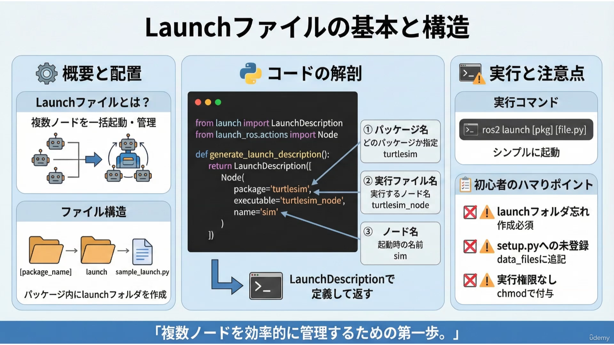
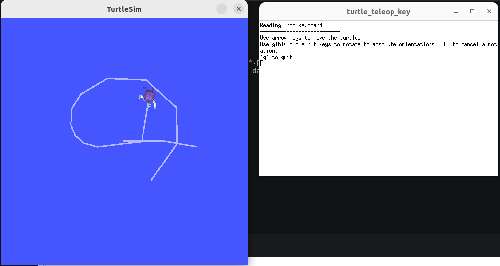
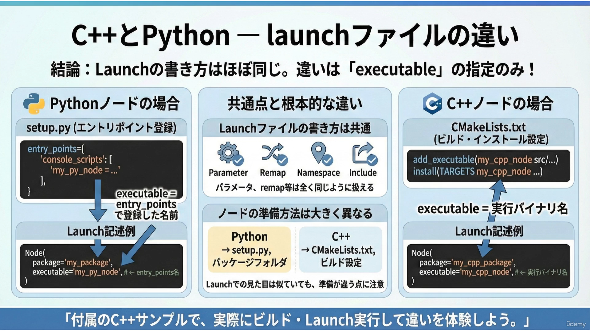

# ROS2 Intro and Application

## Pull Image

```bash
docker pull osrf/ros:jazzy-desktop
```

## Build Container

[docker file](./docker/docker_run_turtle_sim.sh)

## Run TurtleSim

```bash
# In Container
ros2 run turtlesim turtlesim_node
```

## 別のターミナルで、コンテナに入る

```bash
docker exec -it turtle_sim bash
```

## 亀を動かすコマンド

```bash
# ros2にパスを通す
source /opt/ros/jazzy/setup.bash

# 一時的な publisher nodeを作成し、データを送信する
# 文法 : ros2 topic pub [トピック名] [メッセージ型] [メッセージ値]
ros2 topic pub /turtle1/cmd_vel geometry_msgs/msg/Twist "{linear: {x: 2.0}, angular: {z: 1.8}}"

# ctrl + c で送信停止

# 5Hz で送信: -r 5
ros2 topic pub -r 5 /turtle1/cmd_vel geometry_msgs/msg/Twist "{linear: {x: 2.0}, angular: {z: 1.8}}"

# 0.1 Hzで送信: --> 少し動いて、長時間とまっている
# 一方、Jazzy版turtlesimは、最後の速度指令から1秒を超えると、内部の並進速度と角速度をゼロにします。
# ソースコードにも、最後の指令から1秒経過した場合に各速度を0.0へ設定する処理があります。
ros2 topic pub -r 0.1 /turtle1/cmd_vel geometry_msgs/msg/Twist "{linear: {x: 2.0}, angular: {z: 1.8}}"

# トピック一覧を型を含めて表示
ros2 topic list -t

# 結果
/parameter_events [rcl_interfaces/msg/ParameterEvent]
/rosout [rcl_interfaces/msg/Log]
/turtle1/cmd_vel [geometry_msgs/msg/Twist]
/turtle1/color_sensor [turtlesim/msg/Color]
/turtle1/pose [turtlesim/msg/Pose]


# トピックの数値　の内容を表示
ros2 topic echo /turtle1/cmd_vel
ros2 topic echo /turtle1/pose
```

# Workspace の作成

```bash
mkdir -p colcon_ws/src
```

## パッケージの作成: my_py_pkg

- `--build-type ament_python` : ビルド方式の指定、pythonパッケージであることを明示
- `--dependencies` : 参照する他のパッケージを明示
  - `rclpy` : python用の ros2クライアント
  - `std_msgs` : 標準的なメッセージ型
  - `geometry_msgs` : turtlesimで使う速度司令に必要なメッセージ


```bash
cd colcon_ws/src
ros2 pkg create my_py_pkg --build-type ament_python --dependencies rclpy std_msgs geometry_msgs
```

## 自動生成物の確認

- [package.xml](./colcon_ws/src/my_py_pkg/package.xml) : パッケージ名前、バージョン、依存関係を記述
- [__init__.py](./colcon_ws/src/my_py_pkg/my_py_pkg/__init__.py) : pythonモジュールに必要な空ファイル
- [setup.py](./colcon_ws/src/my_py_pkg/setup.py) : pythonパッケージとして、ビルド、インストールするためのファイル

## setup.pyの編集

- entry point を変更する.
- my_node という名前で、ノードを起動できるようにする
- 書き方 : my_node = [パッケージ名].[ノード名]:[関数名]

```python
    entry_points={
        'console_scripts': [
            'my_node = my_py_pkg.my_node:main',
        ],
    },
```

## my_node.py　の作成
- [my_node.py](./colcon_ws/src/my_py_pkg/my_py_pkg/my_node.py)

## パッケージのビルド

```bash
cd ./colcon_ws
colcon build
```

## 自作ワークスペースの環境を読み込む

```bash
cd ./colcon_ws
source ./install/setup.bash
```

## Nodeの実行

```bash
ros2 run my_py_pkg my_node
```

## 他のターミナルで、受信テスト

```bash
# 他のターミナルでコンテナに入る

# この作業環境を読み込む
./colcon_ws/install/setup.bash 

# topic /chatter に送信されているものを取得
ros2 topic echo /chatter 
```

---

# C++版

## Ros2パッケージの作成

```bash
cd ./colcon_ws/src

ros2 pkg create my_cpp_pkg --build-type ament_cmake --dependencies rclcpp std_msgs geometry_msgs
```


- CMakeLists.txt : 
- package.xml : 

## 自動生成物の確認

- [package.xml](./colcon_ws/src/my_cpp_pkg/package.xml) : パッケージ名前、バージョン、依存関係を記述
- [CMakeLists.txt](./colcon_ws/src/my_cpp_pkg/CMakeLists.txt) : ビルド設定
  - pythonと異なり、Cppでは `./colcon_ws/src/my_cpp_pkg/CMakeLists.txt` の編集が、ビルドに必須

## ノードファイルを作成
- [my_node.cpp](./colcon_ws/src/my_cpp_pkg/src/my_node.cpp)


# ROS2コマンドリスト

## コマンド例

```bash
ros2 node list
ros2 topic list

ros2 topic echo

ros2 run turtlesim turtlesim_node
```

- 実行 : `ros2 run`
- ノード管理 : `ros2 node list/info`
- 通信観察 : `ros2 topic echo\hz`
- 型・構造の調査 : `ros2 interface show/type`
- パラメータ管理 : `ros2 param get/set/list`


## ros2 helpの使い方

```bash
ros2 --help
ros2 topic --help
```

## ノードに関するコマンド

```bash
# turtlesimの起動
ros2 run turtlesim turtlesim_node

# 起動中のノードの確認
ros2 node list

# ノードの内部構成を調べる
ros2 node info /turtlesim
```

## トピック通信に関するコマンド

```bash
# トピック一覧を表示
ros2 topic list

# トピックの詳細を調べる
ros2 topic info /turtle1/cmd_vel

# トピックの周波数を調べる -> 通信の停止、遅延の検証ができる
ros2 topic hz /turtle1/cmd_vel

# トピックを手動で送信する
ros2 topic pub /turtle1/cmd_vel geometry_msgs/msg/Twist "{linear:{x:2.0}, angular:{z:1.0}}"
```

## ノードが起動していない／出てこない

```bash
# 実行ファイルの登録名が正しいか？
ros2 run <pkg> <exec>

# ビルドが成功しているか？
colcon build / source install/setup.bash
```

## トピックが届かない

```bash
## チェック内容 コマンド トピックが存在しているか？
ros2 topic list

## 発行元がいるか？
ros2 topic info /トピック名

## 実際にデータが流れているか？
ros2 topic echo /トピック名

## 周波数が異常に遅い／ゼロでは？
ros2 topic hz /トピック名
```

## pubしたいけど型がわからない

```bash
# チェック内容 コマンド トピックの型を調べる
ros2 topic info /トピック名

# 型の中身を確認
ros2 interface show geometry_msgs/msg/Twist
```

## ノードの動きが想定と違う

```bash
# チェック内容 コマンド ノードの詳細構成を確認
ros2 node info /ノード名

# パラメータを見てみる
ros2 param list /ノード名 / ros2 param get
```

## 🧠 トラブル時の確認フロー（まとめ）

1. ノードが動いているか？ → node list
2. 通信が流れているか？ → topic list / echo / hz
3. 型や構造が合っているか？ → topic info / interface show
4. パラメータ設定に問題はないか？ → param get

# 応用編



## launchファイルを作成



- ファイルの場所 : './colcon_ws/src/launch_basic/launch/sample_launch.py'
- ファイルの構造 : './colcon_ws/src/パッケージ名/launch/launchファイル.py'

## launchファイルの中身

```python
from launch import LaunchDescription
from launch_ros.actions import Node

def generate_launch_description():
    return LaunchDescription([
        Node(
            package='turtlesim',
            executable='turtlesim_node',
            name='sim'
        )
    ])
```

## lauchファイルの実行

```bash
ros2 launch [パッケージ名] [ファイル名.py]

# ビルド: launch_basic　というパッケージがビルドされる
cd ./colcon_ws/src/
colcon build

# ros2のパスを通す. ros2大元 と この wsの設定
source /opt/ros/jazzy/setup.bash
source ./install/setup.bash

# launchファイルの実行
ros2 launch launch_basic sample_launch.py
```

## setup.py　と　launchファイルの関係

```python
from setuptools import setup

package_name = 'launch_basic'

setup(
    name=package_name,
    version='0.0.0',
    packages=[package_name],
    data_files=[
        ('share/ament_index/resource_index/packages',
            ['resource/' + package_name]),
        ('share/' + package_name + '/launch', ['launch/sample_launch.py']), # launchファイルの登録
        ('share/' + package_name, ['package.xml']),
    ],
    install_requires=['setuptools'],
    zip_safe=True,
    maintainer='user',
    maintainer_email='user@example.com',
    description='Launch basic package using ament_python',
    license='Apache-2.0',
)
```

## 複数ノードを同時に管理する

1. `./colcon_ws/src/launch_basic/launch/` に *.pyを追加する.
2. `./colcon_ws/src/launch_basic/setup.py` の data_files に */pyを登録する

### setup.pyへの追記方法

```python
    data_files=[
        ('share/ament_index/resource_index/packages',
            ['resource/' + package_name]),
        ('share/' + package_name + '/launch', ['launch/sample_launch.py',
                                               'launch/multi_launch.py' ]), # launchファイルの登録
        ('share/' + package_name, ['package.xml']),
    ],
```

### multi_launch.pyの中身

```python
from launch import LaunchDescription
from launch_ros.actions import Node

def generate_launch_description():
    return LaunchDescription([
        # turtlesim のウィンドウ
        Node(
            package='turtlesim',
            executable='turtlesim_node',
            name='sim'
        ),
        # キーボード操作ノード（別ターミナルで起動）
        Node(
            package='turtlesim',
            executable='turtle_teleop_key',
            name='teleop',
            prefix='xterm -e' # ノードを xtermの新しいターミナルで起動
        )
    ])
```

### 注意点
- ノード名を衝突させない
- 実行順序に気をつける. 依存関係に注意

```bash
# ビルドして、下記のコマンドを実行
# 場所 : ./colcon_ws/src
colcon build
source ./install/setup.bash
ros2 launch launch_basic multi_launch.py
```




## launchファイルにパラメータや引数を渡す方法

### param_launch.py

- ノードにパラメータを渡すファイル
- 下記は、turtlesim起動時の背景色を変更している

```python
from launch import LaunchDescription
from launch.actions import DeclareLaunchArgument
from launch.substitutions import LaunchConfiguration
from launch_ros.actions import Node

def generate_launch_description():
    # Launch arguments (string by default)
    bg_r = LaunchConfiguration('bg_r', default='200')
    bg_g = LaunchConfiguration('bg_g', default='200')
    bg_b = LaunchConfiguration('bg_b', default='255')

    return LaunchDescription([
        DeclareLaunchArgument('bg_r', default_value='200', description='Background red (0-255)'),
        DeclareLaunchArgument('bg_g', default_value='200', description='Background green (0-255)'),
        DeclareLaunchArgument('bg_b', default_value='255', description='Background blue (0-255)'),

        Node(
            package='turtlesim',
            executable='turtlesim_node',
            name='sim_with_params',
            parameters=[{
                'background_r': bg_r,
                'background_g': bg_g,
                'background_b': bg_b
            }]
        )
    ])
```


```bash
# ビルドして、下記のコマンドを実行
# 場所 : ./colcon_ws/src
colcon build
source ./install/setup.bash
ros2 launch launch_basic param_launch.py
```

### 引数でパラメータを渡す

- 背景を黒くする

```bash
ros2 launch launch_basic param_launch.py bg_r:=0 bg_g:=0 bg_b:=0
```

## 条件分岐-1: IfCondition() , UnlessCondition()

### 実行コマンド

```bash
ros2 launch launch_basic conditional_launch.py use_teleop:=true
```

### [conditional_launch.py](./colcon_ws/src/launch_basic/launch/conditional_launch.py)

```python
from launch import LaunchDescription
from launch.actions import DeclareLaunchArgument
from launch.conditions import IfCondition
from launch.substitutions import LaunchConfiguration
from launch_ros.actions import Node

def generate_launch_description():
    use_teleop = LaunchConfiguration('use_teleop') # 引数の use_teleop:=true/false を取得

    return LaunchDescription([
        DeclareLaunchArgument('use_teleop', default_value='true'), # デフォルトはtrue

        Node(
            package='turtlesim',
            executable='turtlesim_node',
            name='sim'
        ),

        Node(
            package='turtlesim',
            executable='turtle_teleop_key',
            name='teleop',
            prefix='xterm -e',
            condition=IfCondition(use_teleop) # 引数の use_teleop:=true のときに、このNodeが実行される
        )
    ])
```

## 他の launchファイルを includeする

- ひとつの　launchファイルを膨大にしたくない場合、ファイルを分けて includeする

### [main_launch.py](./colcon_ws/src/launch_basic/launch/main_launch.py)

```python
from launch import LaunchDescription
from launch.launch_description_sources import PythonLaunchDescriptionSource
from launch.actions import IncludeLaunchDescription
from ament_index_python.packages import get_package_share_directory
import os

def generate_launch_description():

    pkg_share = get_package_share_directory('launch_basic')
    launch_dir = os.path.join(pkg_share, 'launch')

    return LaunchDescription([
        IncludeLaunchDescription(
            PythonLaunchDescriptionSource(os.path.join(launch_dir, 'sim_launch.py')) # ここで、include
        ),
        IncludeLaunchDescription(
            PythonLaunchDescriptionSource(os.path.join(launch_dir, 'teleop_launch.py')) # ここで、include
        )
    ])

```

```bash
# ビルドして、下記のコマンドを実行
# 場所 : ./colcon_ws/src
colcon build
source ./install/setup.bash
ros2 launch launch_basic main_launch.py
```

## ネームスペースの活用

- 2台のロボットを活用するとき、`/cmd_vel` を使うと、混乱する
- `/robot1/cmd_vel` , `/robot2/cmd_vel` のように、ネームスペースを分けると、混戦しない

### [namespace_launch.py](./colcon_ws/src/launch_basic/launch/namespace_launch.py)

```python
from launch import LaunchDescription
from launch_ros.actions import Node

def generate_launch_description():
    return LaunchDescription([
        Node(
            package='turtlesim',
            executable='turtlesim_node',
            name='sim1',
            namespace='robot1' # ネームスペース
        ),
        Node(
            package='turtlesim',
            executable='turtlesim_node',
            name='sim2',
            namespace='robot2' # ネームスペース
        )
    ])
```


```bash
# ビルドして、下記のコマンドを実行
# 場所 : ./colcon_ws/src
colcon build
source ./install/setup.bash
ros2 launch launch_basic namespace_launch.py
```

- 別のターミナルで確認 -> robot1/2のネームスペースで別れている

```bash
$ cd colcon_ws/src/

$ source ./install/setup.bash 

$ ros2 node list
/robot1/sim1
/robot2/sim2

$ ros2 topic list
/parameter_events
/robot1/turtle1/cmd_vel
/robot1/turtle1/color_sensor
/robot1/turtle1/pose
/robot2/turtle1/cmd_vel
/robot2/turtle1/color_sensor
/robot2/turtle1/pose
/rosout
```

## Remapの活用

- topic名やservice名を別の名前に置き換える
- Nodeのコードを変えずに、接続先だけを変えることができる

### [remap_launch.py](./colcon_ws/src/launch_basic/launch/remap_launch.py)

```python
from launch import LaunchDescription
from launch_ros.actions import Node

def generate_launch_description():
    return LaunchDescription([
        Node(
            package='turtlesim',
            executable='turtlesim_node',
            name='sim',
            remappings=[
                ('/turtle1/cmd_vel', '/robot1/cmd_vel') # turtule1 --> robot1 に読み替える
            ]
        )
    ])
```


```bash
# ビルドして、下記のコマンドを実行
# 場所 : ./colcon_ws/src
colcon build
source ./install/setup.bash
ros2 launch launch_basic remap_launch.py
```

- 別のターミナルで動作確認

```bash
$ ros2 node list
/sim

$ ros2 topic list
/parameter_events
/robot1/cmd_vel
/rosout
/turtle1/color_sensor
/turtle1/pose
```

## Launchファイルの違い : Python vs Cpp



## Cppのlaunchファイルを試す

- `./colcon_ws/src/cpp_turtlesim_launch/` をコピペ
- サンプルコードをビルド&実行

```bash
cd /root/colcon_ws
colcon build --packages-select cpp_turtlesim_launch
source install/setup.bash

# 実行. turtlesimのGUIが起動する
ros2 launch cpp_turtlesim_launch turtlesim_cpp_launch.py
```